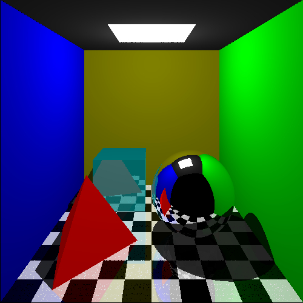
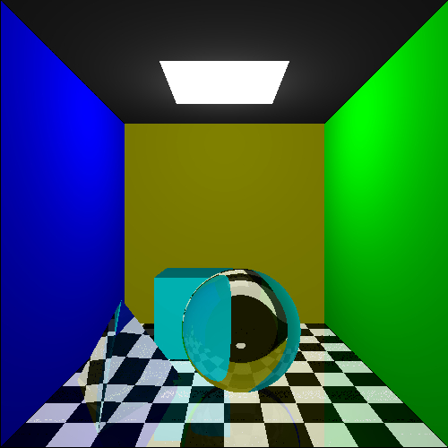

# Ray Tracing from scratch
 This is an implementation of Ray-Tracing algorithm algorithm scratch using pure C++. No graphics libraries whatsoever were used while building this project. It was created using only the basic C++ header files iostream, fstream and cmath. The output is generated as a .ppm file which can be viewed by uploading the outputs [here](https://www.cs.rhodes.edu/welshc/COMP141_F16/ppmReader.html).

# Optimization
 As the object shapes used in this implementation are basic objects like pyramids, spheres and cubes, the computation of Barycentric Coordinate was replaced with basic cross product and dot product calculations to avoid heavy operations like matrix inversions. This resulted in very fast rendering only within a few seconds (2-6 seconds on my PC) without any parallelization whatsoever.
 
# Setup Instructions
 - Simply compile and run both the "RT1.cpp" and "RT2.cpp" using any C++ compiler.
 - View the generated outputs "output1.ppm" and "output2.ppm" by uploading them on [this](https://www.cs.rhodes.edu/welshc/COMP141_F16/ppmReader.html) link.

# Outputs

  

# Technologies Used
 - Pure C++

# Future Plans
 - As can be clearly seen from the outputs, it is very important that we introduce some anti-aliasing methods here. This is left as a future work.
 - This implementation can be extended for ray tracing of other more complex topologies.
 - Identification of ray intersections can be improved using KD-Trees.
 - Once all the above are successfully done, this project can be extended to a rendering project by adding BRDF and BSDF functions.
 
# Acknowledgement

 This project is a result of the inspiration I gained after watching [this](https://www.youtube.com/watch?v=ARn_yhgk7aE&t=1570s&ab_channel=MarcusMathiassen) YouTube video. The inspiration especially came from the fact that the implementation was truly from scratch and not relying on any external libraries whatsoever.
